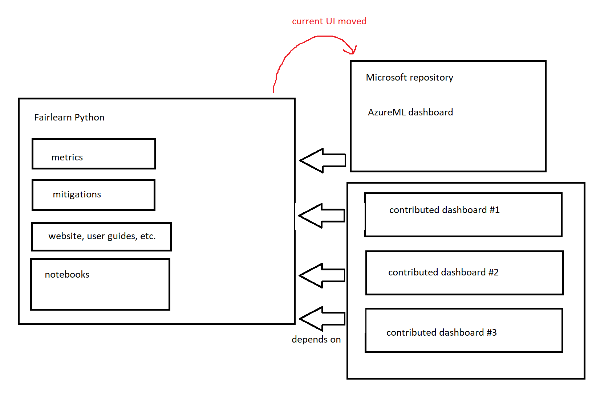
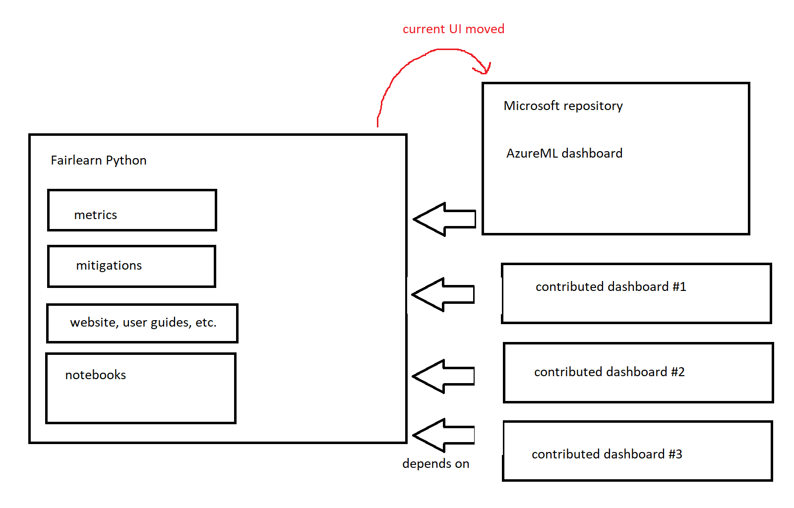

# Proposal regarding the future of UI development in the Fairlearn project

## Current situation

The UI lives in the Fairlearn repository alongside the Python code.
The existing UI in the `visualization` directory is published to `npm` as
`fairlearn-dashboard` and consumed in the `fairlearn.widget` module of the
`fairlearn` Python package.
Users can view the Fairlearn dashboard through Python code in a Jupyter
notebook.
Notably, this is currently the only UI for Fairlearn and is also used in
Azure Machine Learning Studio.

## Problems

1. Several members of the community have voiced concerns with the dashboard
   living alongside the "core" Python code. These included:
   - dashboard is written in Typescript, not Python
   - dashboard has lots of dependencies that are unrelated to Python
   - dashboard shouldn't be part of Fairlearn at all
   - even if it's part of Fairlearn, it should be a dependency and not live in
     the same repo
   - developers assumed that changes to the visualization code would
     automatically be reflected in the widget (which they're not)
2. The dashboard was built with much more complex requirements in mind than
   perhaps required for just the open source package. This is due to its use
   within Azure Machine Learning Studio. Some of these requirements include:
   - localization (support for various languages)
   - accessibility requirements
   - styling (Office Fabric UI) and light/dark/high contrast modes
3. The Python code has been much more open to contributions than the
   Typescript code. The Typescript code lacks documentation and contributor
   guide.
4. Several people mentioned the need to have context-specific visualizations
   as opposed to a fixed dashboard. From a project/website perspective this
   would allow us to think of appropriate visualizations per example notebook
   as opposed to providing a general purpose dashboard with the package.

## Proposal

To address the concerns outlined above we propose to

1. Remove the `visualization` code from Fairlearn.
2. Remove the `fairlearn.widget` module from the `fairlearn` package.
3. Remove existing Fairlearn dashboard from Fairlearn website, unless any
   example notebooks require it. See *endorsements* at the end of the
   proposal for a more general view on UIs and notebooks.
4. Move these pieces into a public open source repository under the
   `microsoft` organization on GitHub (with MIT license as before).
   This is to better signal that the package needs to abide by somewhat
   stricter Microsoft cloud integration requirements.
   That said, contributions would still be welcomed and Roman will add
   clear guidance on how to contribute as well as any additional requirements.
5. Publish a Python package (Name TBD) from the repo in the `microsoft`
   organization that can be installed separately if desired.

In general, this opens up Fairlearn to be the base library that defines
metrics around which anyone can build any type of UI that they find useful.
This supports the idea that fairness is context-specific and allows people
to build the kind of UI that makes sense in their application context.

In the developer call (8/13) this lead to confusion in large part because the
original proposal addresses a smaller concern ("where does this particular
code live?") as opposed to the big picture ("what role does UI have in
Fairlearn and how can the community build UI together?").
This could manifest itself in different ways.
To decide on a suitable path forward there are different options with their
own pros and cons as outlined below.
Please do provide feedback so that we can find a model that works for
everyone so that we can move towards the common goal of building a user
experience according to user needs.

In the charts below the left side is the Fairlearn repository as we have it
before this proposal takes effect with Python modules, website, and notebooks. The only change is that the
existing visualizations (and the corresponding `widget` module) are moved to
a repo under the `microsoft` GitHub organization. Separate from these parts
the bottom right of the charts can be structured in different ways:

1. **Shared repo within the Fairlearn organization**
   

   - With such a repo it's obvious where the community can work together.
     The community may choose to work off of the existing dashboard code
     and extend that (or not).
     The separation from the Azure codebase means that criteria to complete
     PRs are less strict.
     As a consequence, there could be a lot more experimentation than in the
     `microsoft` repo.
   - This requires involvement (time) from the community to handle
     - PRs
     - issues
     - releases
     - communication / coordination

2. **Repos within the Fairlearn organization**
   This is just like 1. except that each UI effort gets its own repo and the
   people behind the effort can have admin privileges.
   If different people work on different dashboards for different application
   contexts a separation of UI repos may be required at some point.

3. **Repos outside the Fairlearn organization**
   

   This is possible even today since anyone could start their own project and
   build on top of the `fairlearn` Python package.

   - It's not as obvious where people can work together on a UI.
   - This may encourage a variety of kinds of visualizations as opposed to
     building everything based on the same stack.
     For example, somebody may build different visualizations in `matplotlib`,
     and yet another contributor may decide to build visualizations in `bokeh`
     for their particular application context.

### Endorsements

Beyond that the Fairlearn project could endorse certain UIs and perhaps
highlight them on its webpage through example notebooks.
The community can decide to set up a set of requirements for such endorsements
if it's considered beneficial.
This might include that the visualizations have to render properly on the
website.
